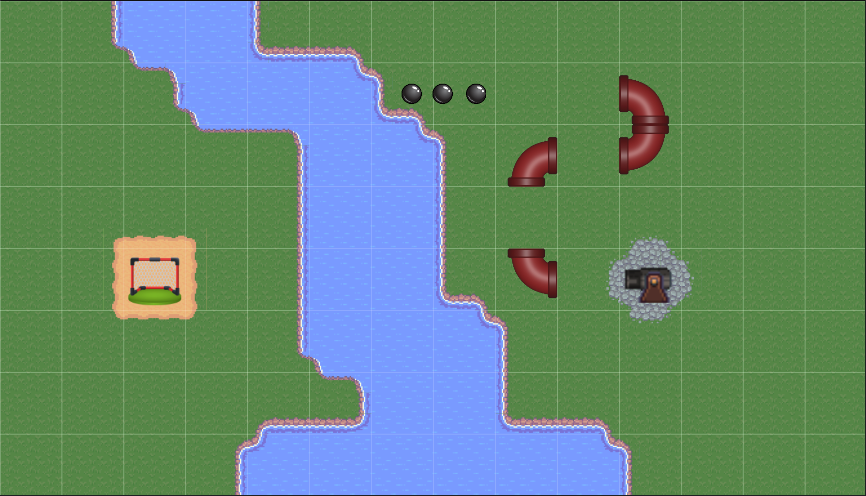

# ball-to-goal

A simple puzzle game for kids.

You have a cannon that shoots balls, gates to hit, and pipes you can move to guide the ball.
Also has stones and water to make levels more complicated.




I made 10 levels. My 4-year-old daughter said it’s fun.

## How to run
```
npm install
npm start        # runs dev server at http://localhost:3000
npm run build    # builds static files into /dist
```

Built with **Phaser 3**, **Typescript**, **Webpack**.

## Tech note

This project was almost entirely written with help of an LLM (vibe-coded).

I gave ideas, the model wrote code. I fixed bugs, added levels, made it work.

No magic. Just a small game made in spare evenings.

